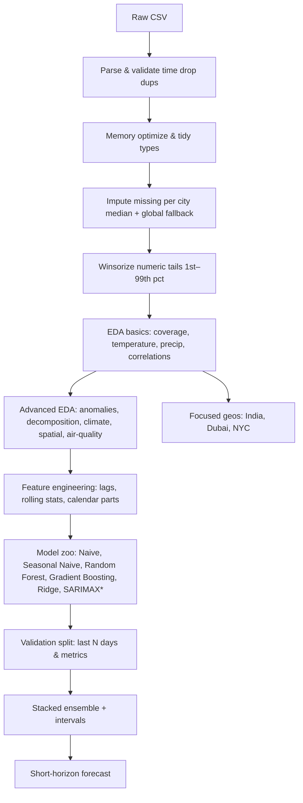
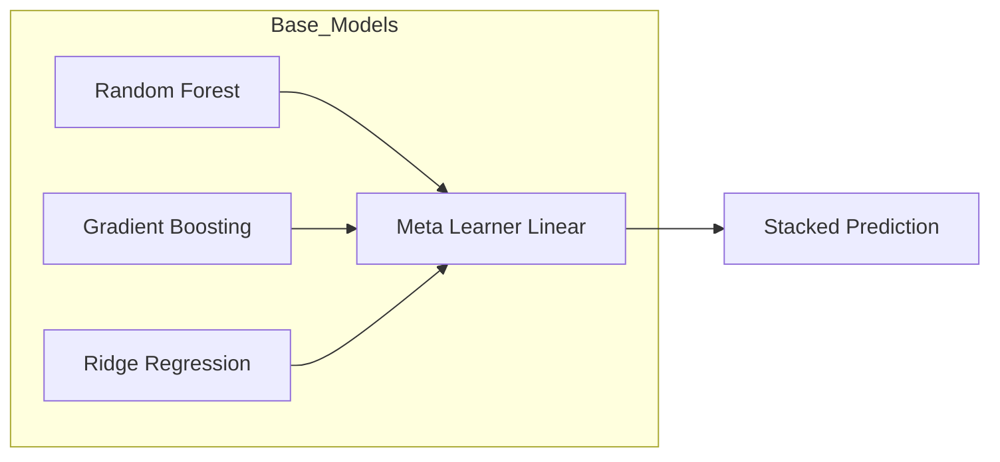
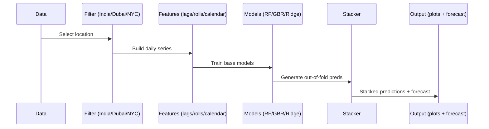

# Weather Trend Forecasting
**Author:** Shubham  
**Application:** Tech assessment for the **Data Scientist** role at **PMA (Product Management Accelerator)** program  
**Date:** August 31, 2025

This repository contains a complete, end-to-end project for **Weather Trend Forecasting** using the *Global Weather Repository* dataset (Kaggle). It fulfills the **basic** and the **advanced** parts of the brief, and adds extra depth—especially around anomaly detection, climate patterns, spatial and geographical analysis, and multi-model forecasting with a small **stacked ensemble**. The **PM Accelerator mission** is surfaced inside the notebook, as requested in the assignment.

> **Deliverables included**
> - Jupyter Notebook: **`Weather Trend Forecasting.ipynb`**
> - Documentation: **`README.md`** (this file) and in-depth report included

---

## 1) Introduction

This notebook was made just for the PMA test.  The goal is to show that you have good practical data-science judgment by doing things like clean preprocessing, clear exploratory work, careful modeling choices, and clear communication.  It's easy to run the code from top to bottom and change it to work with other cities, countries, or forecasting targets. 


---

## 2) Dataset
- **Source:** Kaggle – *Global Weather Repository*  
- **Granularity:** Daily observations across many cities worldwide  
- **Width:** 40+ features: temperature (°C), humidity, wind, pressure, precipitation, visibility, and several **air-quality indices** (PM2.5, PM10, O₃, NO₂, SO₂, etc.).  
- **Time column used:** `last_updated` (converted to datetime and used as the series index)  
- **Entity keys used:** city (`location_name`), `country`, `latitude`, `longitude`

---

## 3) Project structure
```
.
├── Weather Trend Forecasting.ipynb     <- Main notebook (analysis + models + visuals)
├── README.md                           <- You are here
├── In-depth report                     <- For Documentation
└── GlobalWeatherRepository.csv         <- Dataset (place or mount as needed)
```

---

## 4) Setup & running
### 4.1. Environment
Recommended Python ≥ 3.9. Install packages:
```bash
pip install numpy pandas matplotlib scikit-learn statsmodels
```
> The notebook uses **pure Matplotlib** for charts (broad compatibility). If `statsmodels` is missing, SARIMAX/seasonal-decomposition cells will gracefully skip.

### 4.2. Data path
At the top of the notebook set (or keep) the path:
```python
DATA_PATH = "/mnt/data/GlobalWeatherRepository.csv"
```
Adjust as needed for your environment.

### 4.3. How to run
Open **`Weather Trend Forecasting.ipynb`** and **Run All**. The notebook:
1. Loads and cleans data
2. Performs **EDA** (basic & advanced)
3. Builds **multiple forecasting models** and a **stacked ensemble**
4. Produces visuals, metrics tables, and short-horizon forecasts
5. Includes focused analyses for **India (country)**, **Dubai (city)**, and **New York City (city)**

---

## 5) High-level approach (at a glance)


\* If `statsmodels` is unavailable, SARIMAX/decomposition are skipped automatically.

---

## 6) Data cleaning & preprocessing
- Parse and validate `last_updated` as datetime.  
- Drop duplicates.  
- Downcast numeric dtypes for memory optimization.  
- Winsorize numeric columns to 1st–99th percentile.  
- Impute missing values with per-city median, fallback to global median.  
- Standardize text fields like `wind_direction`.  
- Require `latitude`, `longitude`, and target temperature.  

---

## 7) Exploratory Data Analysis (basic)
- Coverage: top cities and monthly coverage.  
- Visuals: daily mean temperature and precipitation.  
- Correlation heatmap.  

---

## 8) Advanced EDA
- **Anomaly detection**: Isolation Forest + rolling z-score.  
- **Seasonal decomposition**: trend, seasonality, residual.  
- **Climate patterns**: monthly climatology and linear warming slope.  
- **Spatial analysis**: continent buckets, latitude bands, 2D lon/lat heatmap.  
- **Environmental impact**: Spearman correlations of air-quality with weather.  

---

## 9) Feature engineering
- Lags: 1, 2, 3, 7, 14, 21, 28 days.  
- Rolling stats: mean/std for 3, 7, 14, 28 days.  
- Calendar parts: year, month, day, dayofweek, weekofyear, dayofyear, weekend flag.  

---

## 10) Modeling & validation
### 10.1. Models
- Naive last value  
- Seasonal Naive  
- Random Forest  
- Gradient Boosting  
- Ridge Regression  
- SARIMAX (optional)  

### 10.2. Stacked ensemble


### 10.3. Validation
- Last N days used as validation.  
- Metrics: MAE, RMSE, MAPE, R².  
- Bootstrap intervals for uncertainty.  

### 10.4. Feature importance
- Tree impurity (RF).  
- Permutation importance.  
- Mutual information.  

---

## 11) Focused locations (India, Dubai, NYC)
For each: climatology, warming slope, anomalies, model metrics, 14-day forecast.  



---

## 12) Results
- Validation tables with metrics.  
- Forecast plots for top global city and focus locations.  
- Anomaly plots, decomposition, climatology slopes, spatial/air-quality analysis.  

---

## 13) Assumptions & limitations
- Weather station quality varies.  
- Strong seasonality mitigated with lags and seasonal-naive.  
- Models trained per city.  
- Air-quality analysis is descriptive only.  

---

## 14) Adaptability
- Change target (humidity, wind, etc.).  
- Focus on other locations.  
- Extend horizon.  
- Add external drivers (holidays, ENSO indices).  

---

## 15) Reproducibility
- Random seeds fixed.  
- Graceful skip if `statsmodels` missing.  
- Pure Matplotlib plots.  

---

## 16) Rubric coverage
- **Basic**: cleaning, EDA, temperature/precip plots, baseline forecast.  
- **Advanced**: anomalies, multi-model ensemble, climate & environmental analysis, feature importance, spatial patterns, focused geographies.  

---

## 17) Quick FAQs
- Why winsorize? Preserve data but cap extremes.  
- Why not deep learning? Faster, interpretable models.  
- Why linear stacker? Transparent blending.  

---

## 18) Acknowledgments
- **Shubham** (author)  
- **Kaggle** – dataset hosting.  

---

## 19) License
For assessment and educational purposes only.  


