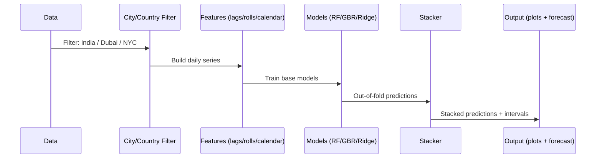

# Weather Trend Forecasting
**Author:** Shubham  
**Role/Application:** Tech assessment for the **Data Scientist** role at **PMA (Product Management Accelerator)** program  
**Date:** August 29, 2025

This repository contains a complete, end‑to‑end project for **Weather Trend Forecasting** using the *Global Weather Repository* dataset (Kaggle). It fulfills the **basic** and the **advanced** parts of the brief, and adds extra depth—especially around anomaly detection, climate patterns, spatial and geographical analysis, and multi‑model forecasting with a small **stacked ensemble**. The **PM Accelerator mission** is surfaced inside the notebook, as requested in the assignment.

> **Deliverables included**
> - Jupyter Notebook: **`Weather Trend Forecasting.ipynb`**
> - Documentation: **`README.md`** (this file)

---

## 1) Why this project exists (and what the reviewer should know)
This notebook was written specifically for the PMA assessment. The aim is to **demonstrate practical data‑science judgment**: tidy preprocessing, readable exploratory work, careful modeling choices, and crisp communication. The code is written so it’s easy to run top‑to‑bottom and easy to adapt to other cities/countries or different forecasting targets.

---

## 2) Dataset
- **Source:** Kaggle – *Global Weather Repository*  
- **Granularity:** Daily observations across many cities worldwide  
- **Width:** 40+ features: temperature (°C), humidity, wind, pressure, precipitation, visibility, and several **air‑quality indices** (PM2.5, PM10, O₃, NO₂, SO₂, etc.).  
- **Time column used:** `last_updated` (converted to datetime and used as the series index)  
- **Entity keys used:** city (`location_name`), `country`, `latitude`, `longitude`

> The notebook reads the CSV and prints a quick inventory (row/column counts, time coverage, unique cities/countries) followed by a missingness snapshot.

---

## 3) Project structure
```
.
├── Weather Trend Forecasting.ipynb     <- Main notebook (analysis + models + visuals)
├── README.md                           <- You are here
└── GlobalWeatherRepository.csv         <- Dataset (place or mount as needed)
```

---

## 4) Setup & running
### 4.1. Environment
Recommended Python ≥ 3.9. Install packages:
```bash
pip install numpy pandas matplotlib scikit-learn statsmodels
```
> The notebook uses **pure Matplotlib** for charts (broad compatibility). If `statsmodels` is missing, SARIMAX/seasonal‑decomposition cells will gracefully skip.

### 4.2. Data path
At the top of the notebook set (or keep) the path:
```python
DATA_PATH = "/mnt/data/GlobalWeatherRepository.csv"
```
Adjust as needed for your environment.

### 4.3. How to run
Open **`Weather Trend Forecasting.ipynb`** and **Run All**. The notebook:
1. Loads and cleans data
2. Performs **EDA** (basic & advanced)
3. Builds **multiple forecasting models** and a **stacked ensemble**
4. Produces visuals, metrics tables, and short‑horizon forecasts
5. Includes focused analyses for **India (country)**, **Dubai (city)**, and **New York City (city)**

---

## 5) High‑level approach (at a glance)

```mermaid
flowchart TD
    A[Raw CSV] --> B[Parse & validate time drop dups]
    B --> C[Memory optimize & tidy types]
    C --> D[Impute missing per city (median) + global fallback]
    D --> E[Winsorize numeric tails (1st–99th pct)]
    E --> F[EDA basics (coverage, temperature, precip, correlations)]
    F --> G[Advanced EDA (anomalies, decomposition, climate, spatial, air-quality links)]
    G --> H[Feature engineering (lags, rolling stats, calendar parts)]
    H --> I[Model zoo Naive, Seasonal Naive, Random Forest, Gradient Boosting, Ridge, SARIMAX*]
    I --> J[Validation split (last N days) & metrics]
    J --> K[Stacked ensemble + intervals]
    K --> L[Short-horizon forecast]
    G --> M[Focused geos: India, Dubai, NYC]
    classDef node fill:#f8f8ff,stroke:#999,stroke-width:1px;
    class A,B,C,D,E,F,G,H,I,J,K,L,M node;
```
\* If `statsmodels` is unavailable, SARIMAX/decomposition are skipped automatically.

---

## 6) Data cleaning & preprocessing
**Goals:** keep signal, limit noise, and be explicit about assumptions.
- **Time parsing:** `last_updated` → pandas datetime; rows with invalid time dropped.
- **Deduplication:** Drop perfect duplicates.
- **Memory optimization:** downcast numeric dtypes.
- **Winsorization:** cap each numeric column to its 1st–99th percentiles to reduce the influence of spiky sensors.
- **Imputation:**  
  - **Per‑city median** for numeric columns where possible (respects local climate);
  - **Global median** as a safe backstop.
- **Text tidy:** e.g., `wind_direction` upper‑cased and stripped when present.
- **Final guardrails:** require `latitude`, `longitude`, and target `temperature_celsius`.

> The notebook prints “before vs after” shape and a top‑N missingness table so the reviewer can see what changed.

---

## 7) Exploratory Data Analysis (basic)
- **Coverage:** Top cities by row count; monthly coverage by country.
- **Target visuals:** Daily mean temperature; precipitation (if a precip/rain column is present).
- **Correlations:** Numeric correlation heatmap (sampling to keep it readable).

**Why this matters:** It gives a quick feel for seasonal patterns, variance, and data balance before modeling.

---

## 8) Advanced EDA (deep dive)
### 8.1. **Anomaly detection**
Two complementary approaches:
1. **Isolation Forest** (per city) using temperature + optional covariates (`humidity`, `wind_kph`, `pressure_mb`) to catch multi‑variate oddities.  
2. **Rolling z‑score** flags (21‑day window) to catch abrupt jumps **and** slow drifts.

> Both views are plotted for the top city so you can compare what each method catches.

### 8.2. **Seasonal shape & trend**
- **Seasonal decomposition** (additive, weekly period=7) when available.  
- Visualizes **trend**, **seasonal rhythm**, and **residual** noise for the best‑covered city.

### 8.3. **Climate patterns across regions**
- **Monthly climatology** per city (average temp per month).  
- **Linear warming slope** per city (°C/decade) via a simple regression of temperature on time.  
- Ranked bar chart of the highest warming slopes (only when sufficient history exists).

### 8.4. **Spatial & geographical patterns**
- **Continent buckets**: lightweight map of `country → continent` + **latitude bands** (Antarctic/South mid/Tropics/…).
- **Distribution plots** of average city temperature by continent and by latitude band.
- **Binned heat map** (2‑D histogram over lon/lat) of average city temperature for a light‑weight “world” view—no external GIS needed.

### 8.5. **Environmental impact (air ↔ weather)**
- Build a clean panel with temperature, `humidity`, `wind_kph`, `pressure_mb` and air‑quality fields (`air_quality_*`).
- Compute **Spearman correlations** (robust to outliers).  
- Plot **pairwise** scatter for a few interpretable pairs (e.g., PM2.5 vs temperature/humidity).

> Purposefully descriptive: signals, not claims of causality.

---

## 9) Feature engineering
The forecast target is **daily mean temperature (°C)** per city.
- **Lags:** 1, 2, 3, 7, 14, 21, 28 days
- **Rolling stats:** rolling means and std over 3, 7, 14, 28 days
- **Calendar parts:** `year`, `month`, `day`, `dayofweek`, `weekofyear`, `dayofyear`, `is_weekend`

---

## 10) Modeling & validation
### 10.1. Models implemented
- **Naive last value**  
- **Seasonal Naive** (weekly period=7)  
- **Random Forest Regressor** (tree‑based, non‑parametric)  
- **Gradient Boosting Regressor** (additive trees)  
- **Ridge Regression** (linear with L2)  
- **SARIMAX** *(optional depending on `statsmodels` availability)*

### 10.2. Stacked ensemble
A simple **linear meta‑learner** blends the base predictions (**RF + GBR + Ridge**) on the validation slice to learn optimal weights. This typically improves stability across different weeks.

```mermaid
flowchart LR
    subgraph Base Models
    A[Random Forest] --> D
    B[Gradient Boosting] --> D
    C[Ridge Regression] --> D
    end
    D[Meta Learner (Linear)] --> E[Stacked Prediction]
    classDef node fill:#f8f8ff,stroke:#999,stroke-width:1px;
    class A,B,C,D,E node;
```

### 10.3. Validation strategy & metrics
- **Temporal split:** last **N days** (default 60) held out for validation.  
- **Metrics:** `MAE`, `RMSE`, `MAPE`, and `R²` reported for every model and the ensemble.  
- **Uncertainty:** Residual **bootstrap bands** (≈80%) plotted for the stacked model on validation.

> Extensions discussed in the notebook: time‑series cross‑validation, more base learners, hyper‑parameter tuning, exogenous regressors, etc.

### 10.4. Feature importance (what actually matters)
- **Tree impurity importance** (RF)  
- **Permutation importance** (model‑agnostic)  
- **Mutual information** (captures non‑linear dependence)

The three views often agree on **recent lags** and **rolling means** as high‑value signals, which is intuitively correct for daily temperature.

---

## 11) Focused geographic stories (India, Dubai, NYC)
A self‑contained section that produces a clear narrative for three reviewer‑friendly locations:
- **India (country):** aggregates across Indian cities; climatology curve; warming slope when length allows; anomaly plot; model bench; 14‑day forecast.  
- **Dubai (city):** single‑city view, same structure (climatology → anomalies → models → forecast).  
- **New York City (city):** city‑specific view with flexible substring match (`"New York"`), same structure.



> Each of the three subsections prints metrics and draws the forecast so you can talk through results cleanly in an interview.

---

## 12) Results you’ll see in the notebook
- Validation tables comparing models, with the stacked model often competitive or best.  
- Forecast plots for the **top global city** and for each **focused location** (India, Dubai, NYC).  
- Clear visuals for anomalies, seasonal shape, climate slopes, continent/latitude comparisons, and air‑quality links.

*(Numbers are printed by the notebook; they depend on the exact data slice you run.)*

---

## 13) Assumptions, limitations & guardrails
- **Data quality:** Measurements may vary by device and station siting; winsorization and per‑city imputation mitigate but do not erase noise.  
- **Stationarity:** Daily temperature shows strong seasonality; we address this via **lags**, **rolling stats**, and **seasonal‑naive** baselines; SARIMAX is optional.  
- **Generalization:** The ensemble is built on recent history for **one city at a time**; forecasting multiple cities in parallel would benefit from hierarchical/pooled models.  
- **Causality:** Air‑quality analyses are **descriptive**. We avoid causal claims.

---

## 14) How to adapt
- **Different target:** Swap `TARGET_COL` to humidity, wind, etc., and re‑run.  
- **Different city/country:** Change the filters in the **Focused** section.  
- **Longer horizon:** Increase `FORECAST_HORIZON_DAYS` and add longer lags (e.g., 35, 42).  
- **Richer features:** Holidays, ENSO indices, or large‑scale climate drivers.

---

## 15) Reproducibility notes
- Fixed **random seeds** where relevant.  
- **Library checks**: if `statsmodels` is missing, those blocks skip gracefully (notebook prints a message).  
- Pure **Matplotlib** used (no styling dependencies).

---

## 16) What to read in the code (map to the rubric)
- **Basic Assessment:** cleaning, EDA, temperature & precip visuals, a baseline forecast from `last_updated` time series.  
- **Advanced Assessment:** anomalies (Isolation Forest + z‑score), multiple models, **ensemble**, climate analysis (climatology + slopes), **environmental** correlations, **feature importance**, **spatial** and **geographical** patterns (continents + latitude bands + binned world view), and focused country/city narratives.

---

## 17) FAQs (quick answers)
- **Why winsorize instead of delete outliers?** Because weather can be spiky; clipping preserves sample size while containing extreme leverage.  
- **Why not deep learning?** A tree/linear stack communicates the modeling logic clearly and runs fast everywhere. If needed, we can add temporal CNN/RNN later.  
- **Why a linear stacker?** It’s transparent: you can see how each base model contributes.

---

## 18) Acknowledgments & credits
- **Shubham** (author)  
- **PMA (Product Management Accelerator)** – assessment guidelines and mission (mission statement displayed in the notebook as required).  
- **Kaggle** – dataset hosting and documentation.

---

## 19) License
For assessment and educational purposes. If you plan to reuse parts commercially, please reach out first.

---

### Final note
This project is designed to be **readable, reproducible, and interview‑ready**. If the reviewer wants a variant—e.g., a different city focus or an additional model—the notebook is structured so that those changes are a two‑line edit.
